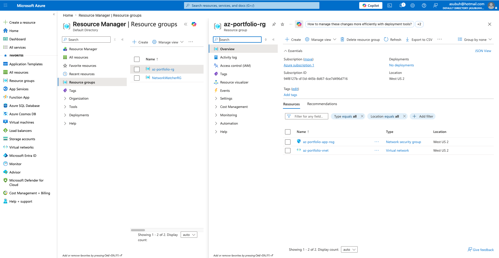

# Azure IaC Landing Zone

## Business Problem
A small business needed a secure, repeatable Azure network 
environment that could be deployed consistently without manual 
configuration errors putting their systems at risk.

## What I Built
I provisioned a secure Azure network foundation using Terraform. 
All infrastructure is defined as code and deployed via the Azure 
CLI — no manual portal configuration.

## Architecture


## Resources I Deployed
- Resource Group
- Virtual Network (10.0.0.0/16)
- Application Subnet (10.0.1.0/24)
- Network Security Group

## Key Decisions
**Why Terraform over manual portal configuration?**
Manual portal configuration is not repeatable or auditable. 
Terraform lets me version control infrastructure the same way 
developers version control code. Any environment can be rebuilt 
in minutes from the same config.

**Why separate variables from the main configuration?**
Hardcoding values like subscription ID and region into main.tf 
makes the code environment-specific and unmaintainable. Separating 
variables makes the same config reusable across dev, staging, 
and production environments.

**Why gitignore the tfvars and state files?**
The tfvars file contains the subscription ID and the state file 
contains a full map of live infrastructure. Committing either 
to a public repo is a security risk. Sensitive values stay 
local, never in version control.

## Tools I Used
- Terraform v1.15
- Azure CLI
- Azure Resource Manager (azurerm provider v4)

## How to Deploy
1. Clone this repo
2. Run `az login`
3. Add your subscription ID to `terraform.tfvars`
4. Run `terraform init && terraform plan && terraform apply`

## How to Destroy
```bash
terraform destroy
```